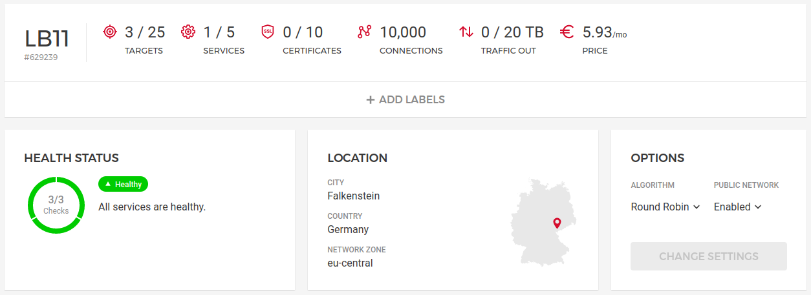

# Aldrin
Multi-node load-balanced Spring Boot setup on VPS with centralized SQL database

## Providers
- Hetzner, EU zone
- OVH, EU zone

## Components
- two `cx11` application instances with `create_before_destroy` policy
- one `cx11` HSQLDB instance with `prevent_destroy` policy
- HTTP load balancer by Hetzner
- `testdomain.ovh` pointed to the load balancer
- private network among all VPS behind the load balancer
- HSQLDB 2.6.1
- Java 11
- OpenJDK
- Spring Boot 2.6.3 including
  - OpenAPI
  - Actuator
  - Data JPA



## Notes
- http only
- applications expose Actuator's endpoint `/actuator/health` for the load balancer
- applications store the visits to `http://testdomain.ovh/` in the database that you may see at REST endpoint `http://testdomain.ovh/api/visits/`
- deployment implements graceful restarts of the applications
- `app.service` overrides the connection string, im-memory by default

## Provisioning and deployment
Create `terraform.tfvars` file with your secrets
```
# https://console.hetzner.cloud/projects/.../security/tokens
hetzner_token_cloud = "..."
# https://console.hetzner.cloud/projects/.../security/sshkeys
hetzner_fingerprint = "..."
# https://api.ovh.com/createToken/?GET=/*&POST=/*&PUT=/*&DELETE=/*
ovh_application_key = "..."
ovh_application_secret = "..."
ovh_consumer_key = "..."
```
then build the project
```
$ mvn clean install
```
and finally
```
$ terraform init
$ terraform apply -auto-approve
var.project_version
  Enter a value: 1.0.1
apps_public = [
  "...",
  "...",
]
db_private = "10.0.1.254"
db_public = "..."
url = "http://testdomain.ovh"
```

## Scale out
Increment `app_nodes` in locals.tf, then
```
$ terraform apply -auto-approve
var.project_version
  Enter a value: 1.0.1
apps_public = [
  "...",
  "...",
  "...",
]
db_private = "10.0.1.254"
db_public = "..."
url = "http://testdomain.ovh"
```

## Credits
- https://stackoverflow.com/questions/63744524/sequential-resource-creation-in-terraform-with-count-or-for-each-possible
