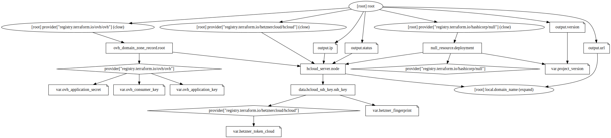

# Armstrong
Single-node plain Java setup on VPS

## Providers
- Hetzner, EU zone
- OVH, EU zone

## Components
- `cx11`, a Debian 11 single-core 2GB VPS by Hetzner
- `testdomain.ovh`, a domain name registered by OVH
- Java 11
- OpenJDK
- Javalin 4.3
- Traefik 2.6.0
- Let's Encrypt



## Notes
- Traefik balances `8000` and `8001` ports
- next application instance binds to one of them
- previous instance is getting terminated
- provisioning may fail on `deployment` step due to unfinished initialization of the VPS. Simply re-try it in 30-60 seconds.

## Provisioning and blue deployment
Create `terraform.tfvars` file with your secrets
```
# https://console.hetzner.cloud/projects/.../security/tokens
hetzner_token_cloud = "..."
# https://console.hetzner.cloud/projects/.../security/sshkeys
hetzner_fingerprint = "..."
# https://api.ovh.com/createToken/?GET=/*&POST=/*&PUT=/*&DELETE=/*
ovh_application_key = "..."
ovh_application_secret = "..."
ovh_consumer_key = "..."
domain_name = "testdomain.ovh"
```
then build the project
```
$ mvn clean install
```
and finally
```
$ terraform init
$ terraform apply -auto-approve
var.project_version
  Enter a value: 1.0.1
ip = "..."
url = "https://testdomain.ovh"
status = "running"
$ curl https://testdomain.ovh/
Version 1.0.1
```

## Green deployment
Increment `version` in pom.xml, build the project
```
$ mvn clean install
```
and finally
```
$ terraform apply -replace=null_resource.deployment -auto-approve
var.project_version
  Enter a value: 1.0.2
ip = "..."
url = "https://testdomain.ovh"
status = "running"
$ curl https://testdomain.ovh/
Version 1.0.2
```
