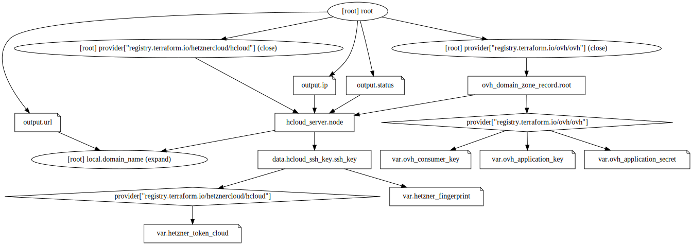

# Gagarin
Single-node plain PHP Symfony setup on VPS

## Providers
- Hetzner, EU zone
- OVH, EU zone

## Components
- `cx11`, a Debian 11 single-core 2GB VPS by Hetzner
- `testdomain.ovh`, a domain name registered by OVH
- PHP 7.4
- PHP-FPM
- Symfony 5.4
- Traefik 2.6.0
- Let's Encrypt



## Notes
- simple security model
- default settings

## Provisioning
Create `terraform.tfvars` file with your secrets
```
# https://console.hetzner.cloud/projects/.../security/tokens
hetzner_token_cloud = "..."
# https://console.hetzner.cloud/projects/.../security/sshkeys
hetzner_fingerprint = "..."
# https://api.ovh.com/createToken/?GET=/*&POST=/*&PUT=/*&DELETE=/*
ovh_application_key = "..."
ovh_application_secret = "..."
ovh_consumer_key = "..."
domain_name = "testdomain.ovh"
```
then
```
$ terraform init
$ terraform apply
ip = "..."
url = "https://testdomain.ovh"
status = "running"
```

## Credits
- [Traefik 101: Deploying Node.js App with PM2 and Traefik using File Provider](https://adapttive.com/blog/deploying-node-js-app-with-pm-2-and-traefik/)
