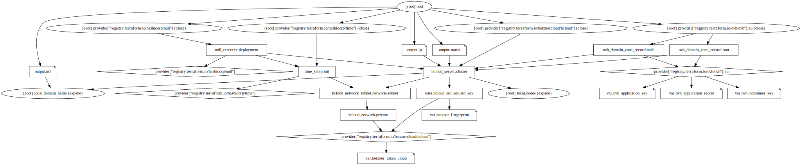

# Liwei
Multi-node plain Node.js setup on VPS in two countries

## Providers
- Hetzner, EU zone
- OVH, EU zone

## Components
- `de.testdomain.ovh` points to `cx11` VPS located in Germany
- `fi.testdomain.ovh` points to `cx11` VPS located in Finland
- `testdomain.ovh` points to both VPS via Round-Robin
- private network among both VPS
- Memcached installed on both VPS
- Node.js 14
- Express.js 4 application



## Notes
- http only
- Express.js runs as root (insecure!) in order to bind port `80` directly
- applications store session cookies on the nodes connecting to both Memcached via private network

## Provisioning
Create `terraform.tfvars` file with your secrets
```
# https://console.hetzner.cloud/projects/.../security/tokens
hetzner_token_cloud = "..."
# https://console.hetzner.cloud/projects/.../security/sshkeys
hetzner_fingerprint = "..."
# https://api.ovh.com/createToken/?GET=/*&POST=/*&PUT=/*&DELETE=/*
ovh_application_key = "..."
ovh_application_secret = "..."
ovh_consumer_key = "..."
```
then
```
$ terraform init
$ terraform apply -auto-approve
ip = {
  "de.testdomain.ovh" = "..."
  "fi.testdomain.ovh" = "..."
}
status = [
  "running",
  "running",
]
url = "http://testdomain.ovh"
```

## Demo
- open http://testdomain.ovh in the browser, refresh the page
- open http://de.testdomain.ovh, refresh the page
- open http://fi.testdomain.ovh, refresh the page
- the counter is incrementing on any server
