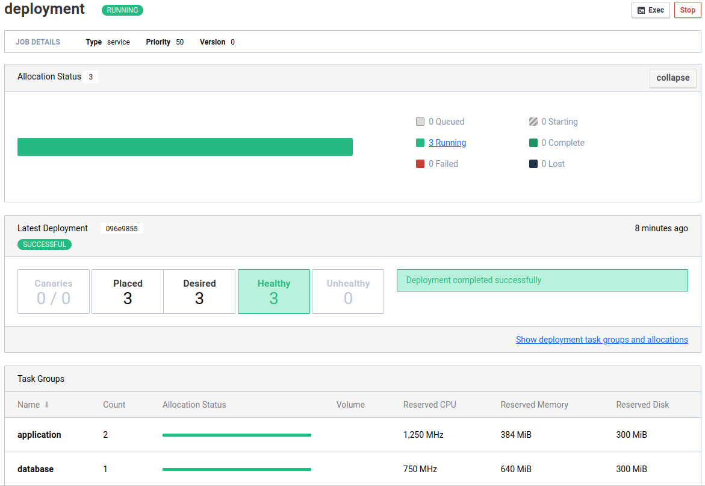

# Ride
Multi-node orchestrated Spring Boot setup on VPS with centralized SQL database

## Providers
- Hetzner, EU zone

## Components
- three `cx11` Hetzner CentOS 8 VPS controlled by Nomad and Consul
  - one master
  - two clients
- firewall by Hetzner
- private network among all VPS
- HSQLDB 2.6.1
- Java 11
- OpenJDK
- Spring Boot 2.6.3 including
  - OpenAPI
  - Actuator
  - Data JPA



## Notes
- no load balancing
- no TLS
- no mTLS
- uses [Spring Boot application](https://gitlab.com/OlegKunitsyn/ride/-/releases) for
- Nomad `java` driver

## Provisioning
Create `terraform.tfvars` file with your secrets
```
# https://console.hetzner.cloud/projects/.../security/tokens
hetzner_token_cloud = "..."
# https://console.hetzner.cloud/projects/.../security/sshkeys
hetzner_fingerprint = "..."
```
then
```
$ terraform init
$ terraform apply -auto-approve
clients = [
  "<IP1>",
  "<IP2>",
]
consul = "http://<CONSUL_IP>:8500"
nomad = "http://<NOMAD_IP>:4646"
```

## Service mesh test
```
$ curl <IP1>
Spring Boot application v.1.0.1<br><a href='/actuator'>App status</a><br><a href='/swagger-ui.html'>Swagger</a>
$ curl <IP1>/api/visits/
$ curl <IP2>/api/visits/
```
